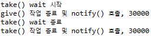
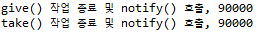

```
Title: Synchronization Examples

Date: 2026.02.19
Author: 최한영
Category: Synchronization Examples
```


<details>
<summary> Q&A - Semaphore & Mutex</summary>
<div>
<br>

Q. 뮤텍스는 이진 세마포어랑 같은건가? <br> 
>A. 둘 다 상호 배체를 위해 사용된다. 값이 0 또는 1처럼 동작할 수 있다. 한 번에 하나의 스레드, 프로세스만 임계 구역에 들어가게 한다. 그래서 개념적으로는 뮤텍스를 이진 세마포어의 한 형태로 볼 수 있다고 설명하기도 한다. 
>하지만 실제로는 차이가 있다. 이진 세마포어는 누가 wait 했는지 상관없이 다른 스레드가 signal 할 수 있다. 뮤텍스는 lock을 건 스레드만 unlock할 수 있다. (뮤텍스가 더 엄격한 상호 배제 도구이다)

Q. 이진 세마포어는는 아무 스레드가 가능하다고 하면 선점형이라는건가?<br>
> A. 아무 스레드나 가능하다라는 말은 소유권이 없다는 뜻이지 CPU 선점과는 전혀 다른 개념이다. 선점형은 운영체제가 실행 중인 스레드를 강제로 중단시키고 다른 스레드를 실행시키는 것을 말한다. 이건 스케줄링 정책 얘기이다.
>'이진 세마포어에서 아무 스레드나 signal 가능하다': 세마포어는 락을 건 주체를 기억하는 개념이 없다.
주체가 없기 때문에 다음과 같이 사용할 수 있다.
>- Thread A: wait(S)
>- Thread B: signal(S)
> 
>누가 wait했는지 중요하지 않다. 누가 signal 하는지도 상관없다. 
>
>뮤텍스와 다른 점은 
>- Thread A: lock()
>- Thread B: unlock() ❌ (에러)
>
> 락을 건 스레드만 해제 가능하다.

Q. unlock의 주체가 다른거네 세마포어는 사용하기위해 대기중인 프로세스를 깨우는거고 뮤텍스는 사용하기 위해 임계구역을 lock한 주체가 스스로 다 썼다고 lock을 해제하는거고
>A. 세마포어에서 signal은 세마포어 값을 증가시키고 대기중인 프로세스가 있으면 하나를 깨운다. 여기에는 소유권 개념이 없다.
즉 누가 wait했는지와 상관없이 다른 스레드가 signal할 수 있다. 그래서 세마포어는 자원의 개수 상태를 관리하는 도구에 더 가깝고 Counting Semaphore는 resource pool을 관리하는데 쓰인다.
>
>뮤텍스는 lock을 한 스레드만 unlock할 수 있다. 여기에는 소유권 개념이 존재한다. 즉, 임계구역에 들어간 주체가 작업을 마친 뒤 스스로 나간다. 이 때는 오히려 다른 스레드가 unlock을 하면 문제가 발생한다.

Q. Binary semaphore는 값이 0 또는 1이다. 0이면 누군가 사용 중이고, 1이면 아무도 사용 안 함이다. 그렇다면 0 → 1로 바꾸는 signal()은 사용 중인 프로세스만 할 수 있는 것 아닌가?
> A. 이진 세마포어는 자원의 소유자를 기억하지 않는다. 값이 0이라는 건 단지 현재 사용가능 수가 0이다 라는 뜻이지 A 프로세스가 사용 중이다라는 뜻이 아니고 세마포어는 누가 wait했는지에 대한 정보가 없다. 그래서 
>
> Thread A:
> wait(S)  → S = 0
> 
> Thread B:
> signal(S)  → S = 1
>
> 뮤텍스와 다르게 서로 다른 주체가 세마포어에 접근하는 것이 가능하다. 
> Producer가 signal, Consumer가 wait에서 Producer는 자원을 쓰지 않는다, Consumer를 깨워준다.
> 이 경우 소유권 개념이 오히려 방해가 된다.

Q. 오히려 소유권이 없기 때문에 signal과 wait를 전용으로 호출하는 주체를 달리할 수 있는거네

> A. 세마포어의 철학: “누가 자원을 가졌는가?”를 추적하는 게 아니라 “지금 자원이 몇 개 남아 있는가?”만 관리한다. 그래서 역할이 나뉠 수 있다.
</div>
</details>


## Classic Problems of Synchronization
동시성 제어 문제의 대표적인 예로는 Bounded-Buffer(Producer–Consumer) 문제, Readers–Writers 문제, 그리고 Dining-Philosophers 문제가 있다.

Bounded-Buffer 문제는 생산자(Producer)와 소비자(Consumer)가 크기가 제한된 공유 버퍼를 함께 사용할 때 발생하는 문제로, 버퍼가 가득 찼거나 비어 있는 상황에서의 동기화와 상호 배제가 핵심이다.

Readers–Writers 문제는 여러 프로세스가 공유 데이터를 읽거나 쓰는 상황에서 발생하며, 여러 Reader는 동시에 접근할 수 있지만 Writer는 단독으로 접근해야 한다는 점이 특징이다. 이 과정에서 기아(starvation) 문제를 방지하는 것이 중요하다.

Dining-Philosophers 문제는 여러 프로세스가 제한된 자원을 공유할 때 발생하는 교착 상태(deadlock)와 기아 문제를 설명하기 위한 고전적인 예로, 각 철학자가 식사를 위해 두 개의 포크를 동시에 확보해야 한다는 설정을 통해 자원 할당 문제를 보여준다.

## Bounded-Buffer
Bounded-Buffer 문제는 하나의 항목을 저장할 수 있는 n개의 버퍼로 구성된 공유 버퍼 풀을 가정한다.

이 구조에서 생산자(Producer)는 데이터를 생성하여 비어 있는 버퍼에 저장함으로써 가득 찬 버퍼를 만들어 내고, 소비자(Consumer)는 가득 찬 버퍼에서 데이터를 꺼내 소비함으로써 다시 빈 버퍼를 만들어 낸다.

이 문제의 핵심은 공유 버퍼에 대한 접근을 올바르게 동기화하는 것이다. 즉, 생산자는 버퍼가 가득 찬 상태에서 데이터를 추가하려 해서는 안 되며, 소비자는 버퍼가 비어 있는 상태에서 데이터를 꺼내려 해서는 안 된다. 또한, 동시에 여러 프로세스가 접근하더라도 데이터가 손상되지 않도록 상호 배제가 보장되어야 한다.


공유 데이터 구조는 버퍼 풀에 대한 올바른 동기화를 위해 세마포어를 사용하여 구성된다.

먼저, 이진 세마포어(binary semaphore)인 mutex는 버퍼 풀에 대한 접근에 상호 배제를 제공하며, 초기값은 1로 설정된다. 이는 한 번에 하나의 프로세스만이 임계 구역(critical section)에 들어갈 수 있도록 보장하기 위함이다.

또한 두 개의 카운팅 세마포어(counting semaphore)인 empty와 full이 사용된다. empty는 현재 비어 있는 버퍼의 개수를 나타내며 초기값은 n으로 설정된다. 반면 full은 가득 찬 버퍼의 개수를 나타내며 초기값은 0으로 설정된다.

이와 같은 세마포어 구조를 통해 생산자와 소비자는 버퍼의 상태를 올바르게 관리하면서도 경쟁 상태(race condition)를 방지할 수 있다.


<details>
<summary> Q&A - empty & full</summary>
<div>

Q. empty + full = n이라서 하나의 세마포어만 사용하면 되지 않나? <br>

> A. Producer와 Consumer의 대기 조건이 다르기 때문에 두 조건이 서로 독립적으로 블록되어야 한다.
> 
> Producer는 empty가 0이면 기다려야 하고(공간이 비길 기다리고) <br>
> Consumer는 full가 0이면 기다려야 한다(공간이 채워지길 기다린다)

</div>
</details>


## The Readers-Writers Problem
Readers-Writers Problem 문제는 동시에 실행되는 프로세스들이 공유 데이터에 대해 읽기나 쓰기 작업을 수행하는 상황을 다룬다. 여러 프로세스가 하나의 DB를 공유하는 경우를 생각할 수 있는데 이때 reader는 DB를 단순히 읽기만 하며 writer는 데이터를 갱신하기 위해 읽기와 쓰기 작업을 모두 수행한다.

공유 데이터에 대해 두 명 이상의 reader가 동시에 접근하는 경우에는 데이터의 내용이 변경되지 않으므로 일반적으로 문제가 되지 않지만 writer가 다른 프로세스와 동시에 DB에 접근할 경우 데이터의 일관성이 깨질 수 있다.

이 문제에는 우선권을 중심으로 하는 몇 가지 케이스가 존재한다.

1. reader에게 우선권을 부여하는 경우 writer가 대기 중이더라도 이미 읽고 있는 다른 reader들 때문에 새로운 reader가 기다려서는 안된다. 이 방식에는 여러 reader가 동시에 자유롭게 접근할 수 있도록 보장하지만 writer는 계속해서 지연될 가능성이 있다.

2. writer에게 우선권을 부여하는 경우 writer가 객체에 접근하기 위해 기다리고 있다면, 새로운 reader는 더 이상 읽기를 시작할 수 없다. 이 방식은 writer의 지연을 방지하지만, 반대로 reader가 오랫동안 기다리는 상황이 발생할 수 있다.

두 케이스 모두 특정 유형의 프로세스가 무한히 대기하기 되는 starvation이 발생할 수 있다.

<br>

첫 번째 문제의 해경방법으로 reader 프로세스들이 몇 가지 공유 자료구조를 함께 사용한다.
```
semaphore rw_mutex = 1;
semaphore mutex = 1;
int read_count = 0;
```
- rw_mutexsms reader와 writer가 모두 공유하는 세마포어로 writer가 공유 객체에 접근할 때 상포 배제를 보장하는 역할을 한다.
- mutex는 변수 read_count를 갱신할 때 상호 배제를 보장하기 위해 사용된다.
- read_count는 현재 공유 객체를 읽고 있는 reader 프로세스의 수를 추적하는 변수이다. 이 값은 첫 번째 reader가 들어올 때와 마지막 reader가 나갈 때 중요한 역할을 하며, 이를 통해 reader들이 동시에 읽을 수 있도록 하면서도 writer와의 충돌을 방지한다.
- reader에게 우선권이 있으므로 writer는 모든 reader가 빠질 때까지 기다려야하기 때문에 현재 총 몇 명의 reader가 작업 중인지를 알아야 한다.

<br>

```
while(true){
    wait(rw_mutex);
    
    /* writing is performed */
    
    signal(rw+mutex);
}

while(true){
    wait(mutex);
    read_count++;
    if(read_count == 1) wait(rw_mutex);
    signal(mutex);
    
    /* reading is performed */

    wait(mutex);
    read_count--;
    if (read_count == 0) signal(rw_mutex);
    signal(mutex);
}

```

만약 한 writer가 임계구역에 들어가 있고 동시에 n개의 reader가 접근을 기다리고 있다면 이들 중 한 reader는 rw_mutex에서 대기하게 되고 나머지 n-1개의 reader는 mutex에서 대기하게 된다. 첫 번째 reader만이 rw_mutex를 획득하려 하기 때문이다. 
- if(read_count == 1) wait(rw_mutex);

writer가 작업을 마치고 signal(rw_mutex)를 실행하면, 대기 중이던 스레드들 중에서 다음에 실행될 주체가 선택된다. 이때 재개되는 대상은 여러 reader 중 하나일 수도 있고, 또 다른 writer 한 명일 수도 있다. 어떤 스레드가 실제로 실행을 이어갈지는 세마포어 자체가 아니라 스케줄러에 의해 결정된다.

<details>
<summary>Q&A - rw_mutex 반환 시</summary>
<div><br>

Q. writer가 작업을 종료 한 후 rw_mutex를 반환 했을 때 가장 먼저 실행되는 스레드는 rw_mutex를 기다리던 스레드가 아닌가? <br>

> A. rw_mutex에서 기다리던 스레드가 먼저 깨워진다. 하지만 실제로 CPU를 먼저 얻어 실행되는 것은 스케줄러가 결정한다.
> wait를 통해 waiting queue에 갔던 프로세스가 ready queue로 가게되는 것이니 CPU를 획득하는건 스케줄러의 몫이 된다.

</div>
</details>

## Reader-Writer Locks
Reader–Writer Lock을 획득할 때에는 락의 모드를 명시해야 하며, 이는 읽기 모드(read mode) 또는 쓰기 모드(write mode) 중 하나이다.

읽기 모드로 락을 획득하는 경우 여러 프로세스가 동시에 락을 가질 수 있다. 이는 읽기 작업이 데이터의 내용을 변경하지 않으므로 동시에 수행되더라도 문제가 발생하지 않기 때문이다. 

쓰기 모드로 락을 획득하는 경우에는 단 하나의 프로세스만이 접근할 수 있다. 쓰기 작업은 데이터를 수정하므로 배타적 접근이 필요하며 다른 reader나 writer와 동시에 실행될 수 없다.


## Java solution to the Bounded-Buffer Problem
```java
synchronized public void give(int money) {
    while (count == buffer.length) {
        try {
            System.out.println("give() wait 시작");
            wait();
            System.out.println("give() wait 종료");				
        } catch (InterruptedException e) {
        }
    }
    buffer[in] = money;
    in = (in + 1) % buffer.length;
    count++;
    System.out.println("give() 작업 종료 및 notify() 호출, " + money);
    notify();
}
```
```java
synchronized public int take() throws InterruptedException {
    while (count == 0) {
        try {
            System.out.println("take() wait 시작");
            wait();
            System.out.println("take() wait 종료");				
        } catch (InterruptedException e) {
        }
    }
    int money = buffer[out];
    out = (out + 1) % buffer.length;
    count--;
    System.out.println("take() 작업 종료 및 notify() 호출, " + money);
    notify();
    return money;
}
```
***1. Consumer가 먼저 접근했지만 버퍼가 비어 있어 wait를 하고 그동안 Producer가 버퍼를 채우고 notify()를 호출하여 Consumer를 깨운다.***

<br><br>


***2. Producer가 먼저 접근하여 버퍼를 채운 경우 Consumer는 대기할 필요 없이 바로 take한다.***



---


## Java solution to the first Readers-Writers Problem
```java
class SharedDB {
	private int readerCount = 0;
	private boolean isWriting = false;

	public void read() {
		this.acquireReadLock();
		this.read();
		this.releaseReadLock();
	}
	
	public void write() {
		this.acquireWriteLock();
		this.write();
		this.releaseWriteLock();
	}
	
	
	synchronized public void acquireReadLock() {
		while (isWriting == true) {
			try {
				wait();
			} catch (InterruptedException e) {
			}
		}
		readerCount++;
	}

	synchronized public void releaseReadLock() {
		readerCount--;
		if (readerCount == 0)
			notify();
	}

	synchronized public void acquireWriteLock() {
		while (readerCount > 0 || isWriting == true) {
			try {
				wait();
			} catch (InterruptedException e) {
			}
		}
		isWriting = true;
	}

	synchronized public void releaseWriteLock() {
		isWriting = true;
		notifyAll();
	}
}
```

## The Dining-Philosophers Problem
Dining-Philosophers 문제는 다섯 명의 철학자가 원형 테이블에 앉아 다섯 개의 젓가락을 서로 공유하면서 생각하기와 식사를 반복하는 상황을 가정한 동기화 문제이다.

철학자들은 배가 고파지면 자신의 왼쪽과 오른쪽에 놓인 두 개의 젓가락을 모두 집으려고 한다. 두 젓가락을 동시에 확보했을 때만 식사를 할 수 있고, 식사를 마칠 때까지 젓가락을 내려놓지 않는다.

이 문제는 단순한 설정처럼 보이지만, 운영체제에서의 프로세스 동기화와 자원 공유 문제를 설명하기 위한 대표적인 예시이다. 젓가락은 한 번에 한 철학자만 사용할 수 있는 공유 자원이며, 철학자들은 이 자원을 얻기 위해 경쟁한다.

운영체제에서의 프로세스 동기화와 자원 공유 문제를 설명하기 위한 대표적인 예시이다. 젓가락은 한 번에 한 철학자만 사용할 수 있는 공유 자원이며, 철학자들은 이 자원을 얻기 위해 경쟁한다.

1. 교착 상태(Deadlock): 모든 철학자가 동시에 왼쪽 젓가락만 집으면, 각자 오른쪽 젓가락을 기다리게 되어 아무도 식사를 하지 못하는 상태가 된다.
2. 기아 상태(Starvation): 특정 철학자가 계속해서 젓가락을 얻지 못하고 무한히 기다리는 상황이다. 다른 철학자들이 계속 자원을 먼저 획득하면 한 철학자는 계속 굶게 된다.   
<br>

Dining-Philosophers 문제는 여러 개의 프로세스에게 여러 개의 자원을 할당해야 하는 상황을 다루며, 교착상태, 기아상태에 빠지지 않도록 자원을 배분해야 한다.

이 문제를 해결하기 위해 운영체제에서는 여러 가지 기법을 사용한다. 예를 들어,
- 한 번에 최대 네 명까지만 젓가락을 집도록 제한하거나
- 젓가락을 집는 순서를 정해 자원 획득에 순환 대기가 생기지 않도록 하거나
- 세마포어(semaphore)나 모니터(monitor) 같은 동기화 도구를 사용하는 방법 등이 있다.

### 1. Semaphore Solution(상호 배제)
각 젓가락을 하나의 세마포어로 표현한다. 세마포어를 이용하여 ***젓가락에 대한 접근을 상호 배제 방식으로 제어*** 한다.

- 철학자는 젓가락을 집기 위해 해당 세마포어에 대해 wait()를 수행한다. 이 연산은 자원이 사용 가능할 때까지 대기하도록하며 사용 가능해지면 자원을 획득한다.
- 식사를 마친 후에는 signal() 연산을 수행하며 젓가락을 내려놓는다.

```java
semaphore chopstick[5];

while(true) {
    wait(chopstick[i]);
    wait(chopstick[(i+1)%5]);
    
    /* eat for a while */
    
    signal(chopstick[i]);
    signal(chopstick[(i+1)%5]);

    /* think for a while */
}
```

### 2. Possible remedies to the deadlock problem(교착 상태)
다섯 명의 철학자가 동시에 자신의 왼쪽 젓가락을 집고 이어서 오른쪽 젓가락을 집으려고 시도한다면 교착 상태에 빠지게 된다. <br>
또한 특정 철학자가 계속해서 두 젓가락을 모두 얻지 못한다면 기아 상태가 발생할 수 있다.

1. 동시에 식탁에 앉을 수 있는 철학자의 수를 최대 4명으로 제한하는 방법이 있다. 네 명이 동시에 젓가락을 집으려고 한다고 해도 ***최소 한 명은 두 젓가락을 모두 얻어 식사를 마칠 수 있으므로*** 순환 대기를 방지한다
2. 두 젓가락이 모두 사용 가능할 때만 집도록 한다. 한 개만 먼저 집는 것이 아니라 두 자원 동시에 확보할 수 있을 때만 획득하도록 한다. 한 철학자가 ***젓가락 하나만 들고 기다리는 상황이 발생하지 않으므로*** 교착 상태를 예방한다.
3. 비대칭(asymmetric). 방식으로 자원을 획득하도록 하는 방법이 있다. 예를 들어 홀수 번호 철학자는 왼쪽 다음 오른쪽 순으로 짝수 번호 철학자는 오른쪽 다음 왼쪽 순으로 젓가락을 집도록한다. ***자원 획득 순서가 다르면*** 모든 철학자가 동일한 순서로 자원을 요청하지 않게 되어 순환 대기가 발생하지 않는다.

### 3. Monitor Solution(기아 상태)
이 방법에서는 철학자가 두 젓가락이 모두 사용 가능할 때에만 집을 수 있도록 한다. 즉, 한 개만 먼저 집고 기다리는 것이 아니라, 조건을 만족할 때만 식사를 시작할 수 있게 만든다.

이를 위해 각 철학자의 상태를 세 가지로 구분한다. 상태는 thinking, hungry, eating이다. 철학자는 배가 고프면 자신의 상태를 hungry로 바꾸고 식사를 시작할 수 있는지 확인한다.

철학자는 자신의 양옆에 앉은 두 이웃이 모두 eating 상태가 아닐 때만 자신의 상태를 eating 상태로 바꿀 수 있다. 인접한 철학자들이 동시에 식사하는 상황을 방지할 수 있다.

조건 변수(condition variable)를 사용한다. 조건 변수는 철학자가 hungry 상태이지만 두 젓가락을 아직 얻을 수 없는 경우 스스로 대기(wait)하도록 만든다. 이후 이웃 철학자가 식사를 마치고 젓가락을 내려놓으면 대기 중이던 철학자를 깨워(signal) 다시 식사를 시도하게 한다.


## Solution to the Dining-Philosophers Problem
Dining-Philosophers 문제의 해결 방법은 젓가락의 분배를 모니터 DiningPhilosopher가 통제하도록 하는 것이다. 즉, 젓가락이라는 공유 자원에 대한 접근을 모니터 내부에서만 이루어지게 하여 동기화를 관리한다.

각 철학자는 식사를 시작하기 전에 반드시 pickup() 연산을 호출해야 한다. 이 과정에서 두 젓가락을 모두 사용할 수 없는 상태라면, 철학자 프로세스는 모니터 안에서 일시적으로 중단(suspend)되어 대기하게 된다.

pickup()이 성공적으로 완료되면, 즉 두 젓가락을 모두 확보하게 되면 철학자는 식사를 할 수 있다. 식사를 마친 후에는 putdown() 연산을 호출하여 젓가락을 내려놓고, 대기 중인 다른 철학자가 자원을 사용할 수 있도록 한다.

이 방식은 상호 배제와 교착 상태의 방지를 보장하지만 여전히 기아 상태가 발생할 가능성이 있다.


```
monitor DiningPhilosophers
{
    enum { THINKING, HUNGRY, EATING } state[5];
    condition self[5];

    coid pickup(int i){
        state[i] = HUNGRY;
        test(i);
        if (state[i] != EATING) self[i].wait();
    }

    void putdown(int i){
        state[i] =THINKING;
        test((i + 4) % 5);
        test((i + 1) % 5);
    }

    void test(int i){
        if( (state[(i+4) % 5] != EATING) && (state[i] == HUNGRY && (state[(i + 1) % 5] != EATING) ) ){
            state[i] = EATING;
            self[i].signal();
        }
    }

    initialization_code(){
        for(int i = 0; i < 5; i++){
            state[i] = THINKING;
        }
    }
}
```

## Java solution to the Dining-Philosophers Problem

<details>
<summary> Code Implementation
</summary>
<div><br>

```java
enum State {
	THINKING, HUNGRY, EATING
}

public class DiningPhilosophers {
	public static void main(String[] args) throws Exception {
		int numOfPhils = 5;
		Philosopher[] philosophers = new Philosopher[numOfPhils];
		DiningPhilosopherMonitor monitor = new DiningPhilosopherMonitor(numOfPhils);
		for (int i = 0; i < philosophers.length; i++)
			new Thread(new Philosopher(i, monitor)).start();
	}
}

```

```java
import java.util.concurrent.locks.Condition;
import java.util.concurrent.locks.Lock;
import java.util.concurrent.locks.ReentrantLock;

class DiningPhilosopherMonitor {
	private int numOfPhils;
	private State[] state;
	private Condition[] self;
	private Lock lock;

	public DiningPhilosopherMonitor(int num) {
		numOfPhils = num;
		state = new State[num];
		self = new Condition[num];
		lock = new ReentrantLock();
		for (int i = 0; i < num; i++) {
			state[i] = State.THINKING;
			self[i] = lock.newCondition();
		}
	}

	private int leftOf(int i) {
		return (i + numOfPhils - 1) % numOfPhils;

	}

	private int rightOf(int i) {
		return (i + 1) % numOfPhils;
	}

	private void test(int i) {
		if (state[i] == State.HUNGRY && state[leftOf(i)] != State.EATING && state[rightOf(i)] != State.EATING) {
			state[i] = State.EATING;
			self[i].signal();
		}
	}

	public void pickup(int id) {
		lock.lock();
		try {
			state[id] = State.HUNGRY;
			test(id);
			if (state[id] != State.EATING)
				self[id].await();
		} catch (InterruptedException e) {
		} finally {
			lock.unlock();
		}
	}

	public void putdown(int id) {
		lock.lock();
		try {
			state[id] = State.THINKING;
			test(leftOf(id)); // left neighbor
			test(rightOf(id)); // right neighbor
		} finally {
			lock.unlock();
		}
	}
}
```
```java
class Philosopher implements Runnable {
	private int id;
	private DiningPhilosopherMonitor monitor;

	public Philosopher(int id, DiningPhilosopherMonitor monitor) {
		this.id = id;
		this.monitor = monitor;
	}

	@Override
	public void run() {
		while (true) {
			think();
			monitor.pickup(id);
			eat();
			monitor.putdown(id);
		}
	}

	private void think() {
		try {
			System.out.println(id + ": Now I'm thinking.");
			Thread.sleep((long) (Math.random() * 500));
		} catch (InterruptedException e) {
		}
	}

	private void eat() {
		try {
			System.out.println(id + ": Now I'm eating.");
			Thread.sleep((long) (Math.random() * 50));
		} catch (InterruptedException e) {
		}
	}

}
```

</div>
</details> 


## Thread-Safe Concurrent Applications

멀티코어 시스템에서 공시성을 활용하는 응용 프로그램은 좋은 성능을 기대할 수 있다. 이를 위해서 뮤텍스 락(mutex lock), 세마포어(semaphore), 모니터(monitor) 와 같은 동기화 기법을 사용한다. 

그러나 동시성 프로그램들은 그만큼 복잡성이 증가하며 Race Condition이나 liveness hazards 같은 Deadlock 문제가 발생할 위험도 커진다. 따라서 여러가지 대안책이 나왔는데 이를 ***Thread-Safe*** 라고 한다.

1. Transactional Memory: 트랜잭셔널 메모리는 공유 메모리 접근을 하나의 트랜잭션 단위로 묶어 처리하는 방식이다. 프로그래머는 특정 코드 블록을 원자적으로 실행되도록 선언하며 시스템은 내부적 충돌을 감지한다. 충돌이 발생하면 해당 트랜잭션을 롤백하고 다시 실행한다.

2. OpenMP: C, C++ 등의 언어에서 병렬 프로그래밍을 지원하는 API이다. 프로그래머는 세부적인 스레드 생성이나 관리 대신 병렬화할 영역을 선언적으로 지정할 수 있으며 런타임 시스템이 스레드 관리와 동기화를 지원한다.

3. Functional Programming Language: 함수형 프로그래밍 언어는 불변성(immutability)과 순수 함수(pure function) 개념을 강조한다. 데이터를 변경하지 않고 새로운 값을 생성하는 방식이기 때문에 공유 가변 상태가 줄어들어 경쟁 조건이 발생할 가능성이 낮아진다. 대표적으로 Haskell, Scala, Erlang 등이 있으며, 이러한 언어들은 동시성 프로그래밍에 더 안전한 구조를 제공한다.