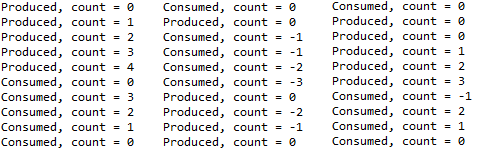
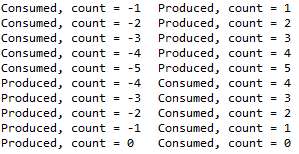
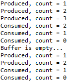

```
Title: Synchronization Tools 1

Date: 2026.02.14
Author: 최한영
Category: Synchronization Tools
```

## Synchronization Tools
Cooperating Processes(협력 프로세스)는 서로에게 영향을 주거나 영향을 받는 프로세스를 의미하며, 데이터를 공유하거나 상호작용하는 프로세스를 말한다. 이러한 협력은 두 가지 방식으로 이루어질 수 있다. 첫째, 공유 메모리나 전역 변수처럼 같은 메모리 공간을 함께 사용하는 논리적 주소 공간 공유 방식이 있다. 둘째, 직접 메모리를 공유하지 않더라도 파일, 메시지, 버퍼 등을 통해 데이터를 주고받는 데이터 공유 허용 방식이 있다.

그러나 여러 프로세스가 동시에 공유 데이터에 접근하는 Concurrent access(동시 접근) 상황이 발생하면, 실행 순서에 따라 데이터 값이 달라질 수 있으며 이로 인해 Data inconsistency(데이터 불일치) 문제가 발생할 수 있다.

공유 데이터를 사용하는 프로세스는 데이터의 일관성을 유지하기 위해 실행 순서를 적절히 통제해야 한다. 여러 프로세스가 하나의 데이터를 함께 사용할 경우, 그 데이터는 항상 정확하고 일관된 상태를 유지해야 하는데 이를 <b>데이터 무결성(Data Integrity)</b> 이라고 한다.

그러나 한 CPU에서 여러 프로세스가 번갈아 가며 실행되는 <b>동시 실행(Concurrent Execution)</b> 환경이나, 두 개 이상의 CPU에서 여러 프로세스가 실제로 동시에 실행되는 <b>병렬 실행(Parallel Execution)</b> 환경에서는 공유 데이터에 대한 접근이 겹칠 수 있다. 

이러한 상황에서는 데이터 값이 예상과 다르게 변경될 수 있으므로, 데이터 무결성을 보장하기 위해 프로세스의 실행 순서를 제어하는 동기화가 필요하다.


```
공유 데이터
↓
Concurrent / Parallel 실행
↓
Race Condition 가능
↓
Critical Section 문제 발생
↓
Synchronization 필요
```

## Producer-Consumer Problem
이 문제는 두 개의 프로세스(또는 스레드)가 하나의 공유 버퍼를 함께 사용하며 서로 비동기적으로(Asynchronously) 실행된다. Producer는 버퍼에 데이터를 추가하는 역할이며 Consumer는 버퍼에서 데이터를 제거하는 역할이다. 두 프로세스는 서로 독립적으로 실행되지만, 같은 버퍼를 공유한다는 점에서 협력 관계에 있다.

버퍼에 들어 있는 항목의 개수를 추적하기 위해 정수 변수 count를 사용한다고 가정하자.

- count는 처음에 0으로 초기화된다.
- Producer가 새로운 항목을 버퍼에 추가할 때마다 count를 1 증가시킨다.
- Consumer가 항목을 하나 제거할 때마다 count를 1 감소시킨다.

<br>

두 프로세스가 각각 독립적으로 실행될 때는 올바르게 동작하더라도, 동시에 실행될 경우에는 기대한 결과가 나오지 않을 수 있다. 예를 들어, 동시 실행 환경에서 Producer와 Consumer가 공유 변수 count를 동시에 수정하면, 실제 버퍼에 저장된 데이터 개수와 count 값이 서로 일치하지 않는 상황이 발생할 수 있다. 이는 공유 자원에 대한 접근이 원자적으로 보호되지 않았기 때문이며, 이러한 불일치 현상이 바로 Race Condition의 대표적인 예이다.

Race Condition을 방지하기 위해서는 공유 데이터에 동시에 접근하지 못하도록 제어해야 한다. 즉, 여러 프로세스(또는 스레드)가 같은 데이터를 사용하더라도 한 번에 오직 하나의 프로세스만 해당 데이터를 수정할 수 있도록 보장해야 한다. 예를 들어, 공유 변수 count를 증가시키거나 감소시키는 연산은 동시에 수행되어서는 안 된다.

이를 보장하기 위해 필요한 것이 바로 **프로세스(또는 스레드) 동기화(Process/Thread Synchronization)** 이다. 동기화란, 공유 자원에 대한 접근 순서를 조절하여 실행 흐름을 통제하는 것을 의미한다. 다시 말해, 여러 실행 단위가 서로 충돌하지 않도록 일정한 규칙에 따라 접근하도록 만드는 메커니즘이다. 이러한 동기화를 통해 한 시점에는 하나의 프로세스만 공유 데이터를 조작하도록 함으로써, Race Condition을 방지하고 데이터 무결성을 유지할 수 있다.

### Code 예시

<details>
<summary>1. Producer–Consumer</summary>
<br>
<div markdown="1">

```java 
class Main {
    public static void main(String[] args) {
        Buffer buffer = new Buffer();

        Producer p = new Producer(buffer);
        Consumer c = new Consumer(buffer);

        p.start();
        c.start();
    }
    
    static class Buffer {
        public int count = 0;   // 공유 변수

        public void produce() {
            count++;            // 항목 추가
            System.out.println("Produced, count = " + count);
        }

        public void consume() {
            count--;            // 항목 제거
            System.out.println("Consumed, count = " + count);
        }
    }

    static class Producer extends Thread {
        private Buffer buffer;

        public Producer(Buffer buffer) {
            this.buffer = buffer;
        }

        public void run() {
            for (int i = 0; i < 5; i++) {
                buffer.produce();
            }
        }
    }

    static class Consumer extends Thread {
        private Buffer buffer;

        public Consumer(Buffer buffer) {
            this.buffer = buffer;
        }

        public void run() {
            for (int i = 0; i < 5; i++) {
                buffer.consume();
            }
        }
    }
}
```

<br>
***매 실행마다 다른 결과 출력***
</div>
</details>


<details>
<summary>2. 동기화 적용 버전 (synchronized 사용)</summary>
<br>
<div markdown="1">

```java
class Buffer {
    private int count = 0;

    public synchronized void produce() {
        count++;
        System.out.println("Produced, count = " + count);
    }

    public synchronized void consume() {
        count--;
        System.out.println("Consumed, count = " + count);
    }
}
```

<br>
***synchronized로 인해 데이터의 무결성은 유지(상호 배제/Mutual Exclusion)되나 순서의 보장은 없음***

</div>
</details>
 
<details>
<summary>3. wait/notify 적용</summary>
<br>
<div markdown="1">

```java
    static class Buffer {
        private int count = 0;
        private int maxSize;

        public Buffer(int maxSize) {
            this.maxSize = maxSize;
        }

        public synchronized void produce() {
            try {
                while (count == maxSize) {
                	System.out.println("Buffer is full...");
                    wait(); // 버퍼가 꽉 차면 대기
                }

                count++;
                System.out.println("Produced, count = " + count);

                notifyAll(); // Consumer 깨움
            } catch (InterruptedException e) {
                Thread.currentThread().interrupt();
            }
        }

        public synchronized void consume() {
            try {
                while (count == 0) {
                	System.out.println("Buffer is empty...");
                    wait(); // 버퍼가 비어있으면 대기
                }

                count--;
                System.out.println("Consumed, count = " + count);

                notifyAll(); // Producer 깨움
            } catch (InterruptedException e) {
                Thread.currentThread().interrupt();
            }
        }
    }
```

<br>
***버퍼에 데이터가 존재할 때만 소비할 수 있음***
</div>
</details>


## Critical Section Problem
**Critical Section Problem(임계구역 문제)** 은 공유 데이터를 사용하는 다중 프로세스 환경에서 발생하는 핵심적인 동기화 문제이다.

시스템에 𝑛개의 프로세스 {P₀, P₁, …, Pₙ₋₁}가 존재한다고 가정하자. 각 프로세스는 코드의 일부 구간을 가지는데, 이를 **임계구역(Critical Section)** 이라고 한다. 이 구간에서는 해당 프로세스가 다른 프로세스와 공유하는 데이터를 접근하거나 수정할 수 있다.

임계구역 문제에서 가장 중요한 조건은 다음과 같다.
어떤 한 프로세스가 자신의 임계구역에서 실행 중이라면, 다른 어떤 프로세스도 자신의 임계구역에 동시에 들어갈 수 없어야 한다는 것이다.

즉, 공유 데이터를 다루는 코드 영역은 반드시 한 번에 하나의 프로세스만 실행할 수 있어야 하며, 이를 통해 데이터 충돌과 불일치를 방지해야 한다.

이처럼 여러 프로세스가 공유 자원에 안전하게 접근하도록 보장하는 것이 바로 임계구역 문제의 핵심이다.

따라서 임계구역 문제의 목표는 여러 프로세스가 데이터를 안전하게 공유할 수 있도록 **동기화 프로토콜(protocol)** 을 설계하는 것이다. 이 프로토콜은 각 프로세스가 임계구역에 진입하고 나오는 과정을 조절하여, 협력적으로(cooperatively) 데이터를 공유하도록 보장해야 한다.

<br>
임계구역에서 각 프로세스의 코드는 네 개의 구역으로 나뉘는데

- Entry Section(진입 구역): 프로세스가 임계 구역에 들어가기 전에 실행하는 코드 부분으로, 임계 구역에 들어갈 수 있는 허가를 요청하는 역할을 한다. 이 구역에서는 다른 프로세스가 이미 임계구역에 있는지 확인하거나, 동기화 도구를 사용해 진입 조건을 검사한다.

- Critical Section(임계구역): 실제로 공유 데이터를 접근하거나 수정하는 코드 부분이며 한 번에 하나의 프로세스만 실행할 수 있어야 한다.

- Exit Section(출구 구역): 이 구역에서는 임계구역 사용이 끝났음을 알리고 다른 프로세스가 임계구역에 진입할 수 있도록 허용하는 작업을 수행한다.

- Remainder Section(나머지 구역): 임계구역과 직접적으로 관련 없는 나머지 코드 부분이며 이 구역에서는 공유 데이터에 접근하지 않으며 동기화 제약을 받지 않는다

```
while(true){
    entry section

        citical section

    exit section

        remainder section
}
```

## Three requirements for the solution

임계구역 문제의 해결책은 반드시 다음의 세 가지 요구 조건을 만족해야한다.

첫째, **Mutual Exclusion(상호 배제)** 이다. 어떤 프로세스 P가 임계구역에서 실행 중이라면, 다른 어떤 프로세스도 동시에 임계구역에 들어가 실행해서는 안된다. 한 순간에는 오직 하나의 프로세스만 공유 데이터를 접근할 수 있어야하며 이를 통해 데이터 충돌을 방지한다.

둘째, **Progress(진행 조건)** 이다. 이는 교착상태(deadlock)를 방지하기 위한 조건이다. 현재 어떤 프로세스도 임계구역에 있지 않고, 하나 이상의 프로세스가 임계구역에 들어가기를 원한다면, 다음에 누가 들어갈지를 무기한으로 미뤄서는 안 된다. 다시 말해, 임계구역이 비어 있다면 반드시 누군가는 합리적인 시간 안에 진입할 수 있어야 한다.

셋째, **Bounded Waiting(한정 대기)** 이다. 기아 상태(Starvation)를 방지하기 위한 조건이다. 어떤 프로세스가 임계구역에 들어가겠다고 요청한 이후, 그 요청이 허용되기까지 다른 프로세스들이 임계구역에 들어갈 수 있는 횟수는 반드시 상한이 존재해야 한다. 특정 프로세스가 무한히 기다리는 상황이 발생해서는 안 된다.

Mutual Exclusion, Progress(avoid deadlock), Bounded Waiting(avoid starvation)를 모두 만족해야 임계구역 문제에 대한 올바른 해결책이라고 할 수 있다.

## A simple solution in a single-core environment
싱글 코어 환경에서는 비교적 단순한 방법으로 임계구역 문제를 해결할 수 있다. 공유 변수를 수정하는 동안 인터럽트가 발생하지 않도록 막는 것이다. 이렇게 하면 현재 실행 중인 명령어들의 순서가 중간에 선점되지 않고 끝까지 실행될 수 있다.

한 프로세스가 공유 데이터를 수정하는 동안에는 CPU가 다른 프로세스로 전환되지 않기 때문에 다른 코드가 실행되어 공유 데이털를 예기치 않게 변경하는 일이 발생하지 않는다. 그 결과 해당 구간은 사실상 임계구역으로 보호되는 효과를 갖게 된다.

그러나 이 방법은 멀티프로세서 환경에서는 실질적으로 사용하기 어렵다. 하나의 코어에서 인터럽트를 막더라도 다른 코어에서는 여전히 다른 프로세스가 동시에 실행될 수 있고, 또한 인터럽트를 장시간 비활성화하는 것은 시스템 전체의 응답성을 떨어뜨리고 운영체제의 정상적인 동작에도 문제를 일으킬 수 있다. 따라서 이 방법은 단일 코어 환경에서는 이론적으로 가능하지만 현대의 멀티코어 시스템에서는 적절한 해결책이 되지 못한다.


## Preemptive Kernels and Non-Preemptive Kernels
운영체제 커널에서 임계구역 문제를 다루는 방식에는 두 가지 접근이 있다. 선점형 커널과 비선점형 커널이다.

먼저 비선점형 커널에서는 커널 모드에서 실행 중인 프로세스가 스스로 커널 모드를 벗어나거나(Block) CPU를 자발적으로 양보하기 전까지는 다른 프로세스에 의해 선점되지 않는다. 커널 코드가 실행되는 동안에는 강제로 중단되지 않기 때문에 커널 내부의 자료구조에 대해 동시에 접근하는 상황이 거의 발생하지 않는다. 이로 인해 커널 데이터 구조에 대한 Race condition 위험이 상대적으로 적다.

선점형 커널는 커널 모드에서 실행 중인 프로세스도 다른 프로세스에 의해 선점될 수 있다. 이는 시스템이 더 빠르게 반응할 수 있도록 해주며, 특히 실시간 시스템이나 사용자 응답성이 중요한 환경에서 유리하다. 그러나 커널 코드가 실행 중 중단될 수 있기 때문에 커널 내부 자료구조에 대한 동기화를 매우 신중하게 설계해야하며 Race condition를 방지하기 위한 추가적인 보호 장치가 필요하다.


## Software Solutions to the Critical-Section Problem
- Dekker’s Algorithm(데커 알고리즘): 두 개의 프로세스를 대상으로 한 초기의 상호 배제 알고리즘이다. 공유 변수와 순번(turn) 개념을 이용해 두 프로세스가 동시에 임계구역에 들어가지 못하도록 제어한다. 이는 이론적으로는 올바르게 동작하지만 구현이 복잡하고 이해하기 어렵다는 단점이 있다.

- Eisenberg and McGuire’s Algorithm(아이젠버그–맥과이어 알고리즘): 데커 알고리즘을 확장하여 n개의 프로세스에 대해 동작하도록 만든 알고리즘이다. 이 알고리즘은 한 프로세스가 임계구역에 들어가기 위해 기다릴 때 최대 n-1번의 다른 프로세스 차례 이후에는 반드시 들어갈 수 있도록 하여 한정 대기(bounded waiting)를 보장한다.

- Peterson’s Algorithm(피터슨 알고리즘): 두 개의 프로세스에 대해 상호배제, 진행, 한정 대기를 모두 만족하는 소프트웨어 해법이다. flag, turn을 이용하여 임계구역 진입을 제어한다. 현대 컴퓨터 시스템에서는 기본적인 기계어 명령이 컴파일러 최적화나 CPU의 명령 재정렬 등에 의해 예상한 순서대로 실행되지 않을 수 있다. 이 때문에 이론적으로는 피터슨 알고리즘이라도 실제 하느웨어 환경에서는 항상 정확히 동작한다고 보장할 수 없다.


## Peterson’s Solution
피터슨 알고리즘은 임계영역과 나머지영역 사이에서 번갈아 실행되는 두 프로세스로 제한된다.

```
int turn;
boolean flag[2];

while (true){
    flag[i] = true;
    turn = j;
    while (flag[j] && turn == j);

        /* critical section */

    flag[i] = false;

        /* remainder section */
}
```

<br>

> 피터슨 알고리즘이 이론적으로는 완벽하지만, 현대 컴퓨터에서는 항상 안전하다고 보장할 수 없는지
>
> 컴파일러 최적화: 피터슨 알고리즘은 명령어가 정확히 프로그램에 작성된 순서대로 실행된다는 것을 가정하는데 에선 컴파일러는 코드 실행을 빠르게 하기 위해 불필요한 메모리 접근 제거, 변수 값을 레지스터에 보관, 명령 재배치를 수행한다. 
>
> CPU의 Out-of-Order Execution: 현대 CPU는 성능 향상을 위해 명령을 병렬로 실행, 순서를 재정렬, 메모리 접근을 지연한다.
>
> 캐시와 메모리 가시성 문제: 멀티 코어 환경에서는 각 코어가 자기 캐시를 가짐, 한 코어에서 변경한 값이 다른 코어에서 즉시 보이지 않을 수 있음. Peterson은 "공유 메모리가 즉시 일관성 있게 보인다"는 가정을 한다.


## Hardware Support for Synchronization
임계구역 문제를 해결하기 위해 운영체제와 시스템 설계에서는 하드웨어 기반 해결방법을 사용하기도 하는데 하드웨어가 직접 제공하는 명령어와 기능을 이용해 상호 배제와 동기화를 보장하는 방식이다. 하드웨어 지원 기능은 그 자체로도 동기화 도구로 사용될 수 있으며 세마포어나 뮤텍스와 같은 보다 추상적인 동기화 메커니즘을 구현하는 기반이 된다.

- Memory Barriers or Fences: 명령어 재정렬을 방지하여 메모리 연산이 의도한 순서대로 수행되도록 보장한다.

- Hardware Instructions: Test-and-Set이나 Compare-and-Swap과 같이 하나의 연산을 원자적으로 수행하여 여러 프로세스가 동시에 공유 변수에 접근하더라도 충돌이 발생하지 않도록 한다.

- Atomic variables: 읽기와 쓰기 연산이 분리되지 않고 하나의 불가분 연산으로 수행되도록 보장하여 동시 접근 상황에서도 데이터의 일관성을 유지할 수 있게 한다.

## Atomicity
**Atomicity** 이란 어떤 연산이 더이상 쪼개질 수 없는 하나의 단위로 수행되는 특성을 의미한다. 원자적 연산(Atomic operation)은 실행 도중 인터럽트되거나 다른 프로세스에 의해 중간 상태가 관찰되지 않으며 처음부터 끝까지 한 번에 수행되는 연산이다.

이러한 원자성을 보장하기 위해 특별한 하드웨어 명령어를 제공한다. 메모리의 특정값을 검사하면서 동시에 수정하거나(test and modity) 두 메모리 위치의 값을 비교한 뒤 조건에 따라 교환하는 작업(compare and swap)을 하나의 불가분 연산으로 수행한다. 따라서 여러 프로세스나 스레드가 동시에 같은 데이터를 접근하더라도 해당 연산은 중간에 방해받지 않고 안전하게 수행된다.

- **test_and_set()** 은 어떤 변수의 값을 검사한 뒤 그 값을 새로운 값으로 설정하는 동작을 하나의 원자적 연산으로 수행한다. 
  
- **compare_and_swap()** 은 특정 변수의 현재 값이 기대한 값과 같은지 비교한 뒤, 같을 경우에만 새로운 값으로 교체하는 연산을 원자적으로 수행

**Atomic Variable(원자 변수)** 는 기본 자료형애 대해 원자적 연산을 보장하는 변수이다. 일반적으로 이러한 원자 변수는 하드웨어가 제공하는 compare_and_swap()과 같은 원자 명려어를 기반으로 구현된다. 특정 값이 기대한 값과 일치할 때만 새로운 값으로 교체하는 연산을 하나의 불가분(atomic) 연산으로 수행함으로써 중간에 다른 스레드가 끼어들 수 없도록 한다.

원자 변수는 정수나 불리언과 같은 기본 자료형에 대해 원자적 읽기, 쓰기 및 갱신 연산을 제공한다. 공유 변수에서 Race cond. 이 발생할 수 있는 상황이라면 해당 변수를 원자 변수로 선언하여 동시 접근 문제를 해결할 수 있다. 이렇게 하면 여러 스레드가 동시에 값을 수정하려 하더라도 각 연산이 원자적으로 수행되므로 상호 배제를 보장할 수 있다.

원자 변수는 복잡한 lock 구조를 사용하지 않고도 단일 공유 변수에 대한 경쟁 상태를 안전하게 제어할 수 있는 효율적인 동기화 수단이다.
