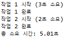

```
Title: Merge Sort

Date: 2026.02.04
Author: 최한영
Category: Thread
```

## 선행 개념
#### 스레드란
    스레드는 CPU 스케줄러에 의해 할당되는 기본 실행 단위이다. 프로세스가 실행되지 기작하면 운영체제로부터 메모리와 자원을 할당 받는데 그 프로세스 내부에서 실질적인 명령어를 실행하는 흐름이 바로 스레드다.
    
    각 스레드는 함수 호출 기록을 위한 Stack메모리와 다음 실행할 명령어의 주소를 가리키는 PC
    (Program Counter) 레지스터를 개별적으로 가진다. 이를 통해 독립적인 실행 흐름을 유지한다.

    동일 프로세스 내의 스레드들은 Code(프로그램 실행코드), Data(전역 변수나 Static 변수), Heap(동적 할당된 메모리 공간) 영역을 공유한다.

#### Context Switching
    하나의 CPU코어는 한 번에 하나의 스레드만 실행할 수 있으나 운영체제는 Context switching을 매우 빠르게 수행하여 여러 스레드가 동시에 실행되는 것처럼 보이게 한다.

        1. T1 실행: CPU 레지스터에 T1의 상태 정보 저장
        2. 전환: T1의 상태를 Stack에 백업하고, T2의 상태를 레지스터로 복구
        3. T2 실행: 새로운 스레드 명령 수행

#### 프로세스와 스레드
    단일 스레드일 때는 하나의 PCB가 하나의 TCB만 가질 뿐 프로세스라는 자원 집합체와 그 안에 슬제로 명령어를 수행하는 스레드의 역할은 다르다.

        - PCB(Process Control Block)는 운영체제가 프로세스를 관리하기 위해 할당하는 메모리 블록이며 이곳에는 PID, 상태, 메모리 관리 정보 등이 담긴다.
        - TCB(Thread Control Block)는 프로세스 내에서 스레드의 상태를 관리하는 블록이다.

    프로세스는 주소 공간, 파일 핸들, 보안 권한 등 시스템 자원의 소유 주체이지만
    스레드는 이 자원을 사용하여 코드를 실행하는 동적인 주체가 된다.

    현대 운영체제에서 CPU 스케줄링의 최소 단위는 프로세스가 아니라 스레드지만 스레드 개념이 없던 예전에는 프로세스를 개별 실행단위로 취급했다.

#### 왜 스레드를 스케줄링하는가
    - 운영체제는 CPU를 효율적으로 사용하기 위해 실행 흐름(Thread)을 추적한다.
    - 프로세스는 실행에 필요한 자원(메모리, 파일 등)을 담는 정적인 컨테이너에 가깝다.
    - 스레드는 실제로 명령어를 실행하고 레지스터 값을 바꾸는 동적인 개체이다
    - CPU는 자원을 소유한 주체가 누구인지보다는, 다음에 어떤 코드를 실행해야 하는지가 더 중요하다.
    - 따라서 커널 스케줄러는 TCB를 관리하며 어떤 스레드에 CPU 시간을 할당할지 결정한다.

#### 할당 단위 비교
    스레드 1개의 프로세스A와 스레드 3개의 프로세스B가 있다고 가정할 때 프로세스 단위로  스케줄링한다면 A와 B는 50:50로 시간을 갖게 되어 B는 50/3 16.6씩 CPU를 할당받게 된다.

    스레드 단위라면 각 스레드가 25%의 CPU를 할당받게 된다.(현대의 OS)
    
#### Context Switching의 차이
    스케줄러가 Context Switching을 통해 다음 실행할 스레드를 선택했을 때 이전 스레드와 다음 스레드가 어느 프로세스 소속이냐에 따라 작업량이 달라지게 된다.

    - 같은 프로세스 내의 스레드 이동이라면
        - 메모리 주소 공간(Page Table)을 바꿀 필요가 없어진다.
        - CPU 캐시 데이터나 TLB(주소 변환 캐시)를 그대로 유지할 수 있다.

    - 다른 프로세스의 스레드로 이동된다면
        - 프로세스 자체를 변경하는 작업이 동반된다.
        - 메모리 매핑 정보를 새로 로드해야하고 기존 CPU 캐시를 비워야 하므로 오버헤드가 크다.

## 단일(Single) 스레드
    1. 이벤트 루프와 비동기 I/O
        단일 스레드에서의 최대 단점은 Blocking인데 DB에서 데이터를 가져오는 1초 동안 가만히 기다린다면 그동안 다른 어떤 요청도 처리할 수 없기 때문에 이를 해결하기 위해 비동기 I/O를 사용한다.

        - 비동기 처리: 스레드가 데이터를 요청하고 결과를 기다리지 않고 다른 요청을 처리한다. 요청했던 작업이 완료되면 이벤트가 발생하고 루프가 이를 감지하여 미리 등록된 콜백 함수를 실행한다.

    2. 컨텍스트 스위칭 비용의 제로화
        멀티스레드 시스템은 수많은 스레드를 교체하며 실행하기 위해 컨텍스트 스위칭 오버헤드가 발생한다. 하지만 단일 스레드는 이 교체 작업이 아예 없다.
  
        - Redis같은 DB가 단일 스레드를 고집하는 이유도 메모리 접근 속도가 워낙 빨라서 스레드를 교체하는 시간보다 순서대로 처리하는게 더 빠르기 때문
  
    3. CPU 집약적인 작업
        단일 스레드 모델의 큰 적은 계산이 복잡한 작업이다.

        - I/O 바운드 작업: 파일 읽기, 네트워크 요청 등 대기 시간이 긴 작업은 비동기로 던져놓으면 되므로 단일 스레드에 최적이다.
        - CPU 바운드 작업: 복잡한 암호화, 대규모 이미지 처리 등 CPU가 계속 계산해야 하는 작업은 스레드를 점유해버린다. 이 때 뒤에 대기중인 모든 요청이 멈추는 병목 현상이 발생한다.

    4. Multi-processing
        단일 스레드 프로세스라고 하더라도 프로세스를 여러 개 실행시켜 각각의 코어(멀티코어)에 할당하면 하드웨어 성능을 끌어낼 수 있다.

#### 간단한 코드 예시
```java
public static void main(String[] args) {
    long startTime = System.currentTimeMillis();

    // 첫 번째 작업
    System.out.println("작업 1 시작 (3초 소요)");
    try {
        Thread.sleep(3000); // 현재 실행 중인 스레드를 3초간 멈춤 (Blocking)
    } catch (InterruptedException e) {
        e.printStackTrace();
    }
    System.out.println("작업 1 완료");

    // 두 번째 작업
    System.out.println("작업 2 시작 (2초 소요)");
    try {
        Thread.sleep(2000); // 2초간 멈춤
    } catch (InterruptedException e) {
        e.printStackTrace();
    }
    System.out.println("작업 2 완료");

    long endTime = System.currentTimeMillis();
    System.out.println("총 소요 시간: " + (endTime - startTime) / 1000.0 + "초");
}
```


## 멀티(Multi) 스레드

#### 멀티코어 CPU가 여러 스레드를 물리적으로 동시에 처리하는 방식(병렬성)
    과거 싱글 코어 환경에서는 CPU가 여러 작업을 아주 빠르게 번걸아 가며 수행(동시성)했지만 현대에 멀티코어 CPU는 실제로 여러 작업을 동시에 수행한다.

    CPU 사양에 4코어 8스레드라는 것은 물리적 코어는 4개인데 OS는 이를 8개로 인식하는 기술을 뜻한다. CPU 코어 내부의 연산 장치는 매우 빠르지만 메모리에서 데이터를 가져오는 동안에는 아무것도 못하고 쉬게된다.(Stall)
    이 때 쉬고 있는 연산 자원을 놀리지 않기 위해 하나의 물리코어가 두 개의 스레드를 받아서 처리하도록 만든다.
    실제 물리적 코어가 늘어나는 것은 아니지만 CPU 자원 활용도를 높여 전체적인 처리 속도를 향상시킨다.

> 병렬성: 여러 코어가 실제로 여러 스레드를 한꺼번에 돌리는 것
 
> 하이퍼스레딩: 코어의 노는 시간을 줄이기 위해 하나의 코어가 두 스레드를 번갈아 처리하는 하드웨어 기술

#### 동기화 문제
    스레드들이 Heap 영역의 공유 변수에 동시에 접근하여 수정할 때 데이터의 일관성이 깨지는 경쟁 상태(Race Condition)가 발생할 수 있다. 이를 해결하기 위해 뮤텍스(Mutex)나 세마포어(Semaphore)같은 동기화 기법이 필수적으로 사용된다.

#### 간단한 코드 예시
```java
public static void main(String[] args) {
    // 새로운 스레드 생성
    Thread worker = new Thread(() -> {
        System.out.println("별도 스레드: 작업 시작 (3초 소요)");
        try { Thread.sleep(3000); } catch (InterruptedException e) {}
        System.out.println("별도 스레드: 작업 완료");
    });

    worker.start(); // 작업을 지시하고 메인 스레드는 바로 다음으로 넘어감

    System.out.println("메인 스레드: 기다리지 않고 작업함");
}
```


## 비교
    단일 스레드 프로그래밍의 입력이 같다면 언제나 실행 순서와 결과가 100%동일하고 멀티스레드처럼 어느 스레드가 먼저 실행될지 모르는 무작위성이 없다. 또한 현재 실행중인 코드가 CPU 코어와 메모리 주소 공간을 온전히 제어하기 때문에 다른 스레드의 영향을 받을 걱정이 없다.

    멀티스레드를 사용해야 하는 경우는 보통 서버에 데이터를 요청하고 응답이 올 때까지 대기해야하는 시간을 활용하려고 하거나 다량의 데이터를 병렬 처리를 이용하여 시간을 단축시키고자 할 때가 있다.